# Romário Barros Costa

<div align="center">

  [](https://git.io/typing-svg)

</div>

---

## 👨‍💻 Sobre Mim

Farmacêutico formado com visão analítica e experiência em **gestão e processos**, atualmente em transição para a área de tecnologia cursando **Análise e Desenvolvimento de Sistemas**.

Minha trajetória única combina **rigor científico**, **pensamento analítico** e **experiência em processos regulatórios** com a paixão por desenvolvimento de software e inovação tecnológica.

🎯 **Foco:** Desenvolvimento Backend e Inteligência Artificial
📚 **Aprendizado Contínuo:** Estudando C# e aprofundando conhecimentos em arquitetura de sistemas
🤝 **Trabalho em Equipe:** Experiência em ambientes colaborativos e multidisciplinares
⚡ **Diferenciais:** Maturidade profissional, visão de processos e capacidade de resolução de problemas complexos

---

## 🛠️ Stack Tecnológico

### Backend (Foco Principal)


### Áreas de Interesse


### Ferramentas & Plataformas


---

## 💼 Competências Profissionais

```text
✓ Gestão de Processos          ✓ Trabalho em Equipe
✓ Pensamento Analítico          ✓ Maturidade Profissional
✓ Aprendizado Contínuo          ✓ Resolução de Problemas
✓ Visão de Negócio              ✓ Adaptabilidade
```

---

## 📊 Estatísticas GitHub

<div align="center">

  

  

  

</div>

---

## 🎯 Minha Jornada

```mermaid
graph LR
    A[Farmácia] -->|Gestão & Processos| B[Transição Tech]
    B -->|Estudos| C[Dev Backend]
    C -->|Evolução| D[IA & Inovação]
    style A fill:#4CAF50
    style B fill:#2196F3
    style C fill:#9C27B0
    style D fill:#FF9800
```



**Farmácia** → Experiência em processos regulatórios e gestão
**Tech** → Desenvolvendo soluções backend escaláveis
**Futuro** → IA aplicada à saúde e inovação tecnológica

---

## 🌱 Atualmente

- 🔭 Estudando **C#** e **.NET** para expandir stack backend
- 🌐 Desenvolvendo projetos com **Python** e **Node.js**
- 🤖 Explorando **Inteligência Artificial** e **Machine Learning**
- 📖 Aprofundando conhecimentos em **arquitetura de software** e **design patterns**
- 💡 Buscando oportunidades para contribuir em projetos open source

---

## 📫 Contato

<div align="center">

  [](https://linkedin.com/in/seu-perfil)
  [](https://github.com/romariobc)
  [](mailto:seu-email@email.com)

</div>

---

<div align="center">

  ### "A melhor forma de prever o futuro é construí-lo"

  

</div>
